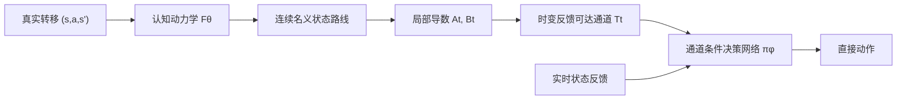

# CPBN：认知动力学到反馈可达通道

本分支是项目的精简研究主线。目标是：只在一种物理环境中预训练认知网络和决策网络；环境物理参数改变后，认知网络依靠真实状态转移持续学习，更新后的物理规律必须进入决策前向传播，从而带动策略快速恢复。

旧版分阶段实验保留在提交 `f458b37` 和分支 `feature/cognitive-embedded-decision` 中。当前主线位于 `feature/cognitive-pullback-bellman`。

## 研究约束

1. 认知网络只做状态转移预测，不产生动作；
2. 认知损失与决策损失分开，决策训练不能破坏认知参数；
3. 决策前向传播必须使用认知侧提供的动力学信息；
4. 决策网络直接输出动作，而不是在运行时对动作做迭代优化；
5. 源环境首先需要完成任务，之后再考察物理参数变化后的恢复速度。

## 已排除的路径：隐式 Bellman 动作层

最初的精简架构把价值函数通过动力学模型拉回动作空间：

\[
Q_{\theta,\phi}(s,a;g)
=r(s,a,F_\theta(s,a);g)
+\gamma V_\phi(F_\theta(s,a),g),
\qquad
a^*=\arg\max_a Q_{\theta,\phi}(s,a;g).
\]

Oracle 动力学实验中，动作求解器的 KKT 满足率和局部凹比例都是 100%，相对动作网格的 regret 约为 `-5.6e-8`，但任务成功率是 0/16。原因不是求解器不准确，而是一步 Bellman 目标没有传播“先摆动蓄能、再到达目标”的长时域可达性，最终收敛到低动作固定点。

因此当前不再继续调整隐式动作求解器。

## 当前主线：时变反馈可达通道

随后实验依次验证了粗状态路由、经验终点椭球和反馈通道。结果表明，认知网络向决策网络提供的数学对象非常关键：孤立终点或开环终点分布不能保证存在一个状态反馈策略将系统稳定送达。

当前算子链为：



在 Oracle 检查点中，先搜索一条连续 480 步状态路线，再从初始蓄能、高速运动和末端摆起三个阶段构造 24 步通道。局部动力学为

\[
\delta x_{t+1}\approx A_t\delta x_t+B_t\delta a_t,
\]

每个通道截面使用完整 `4×4` 精度矩阵描述角度—速度耦合关系：

\[
\mathcal T_t=
\{x:\delta x_t^\top P_t\delta x_t\le r_t\}.
\]

LQR 只用于证明通道具有反馈可执行性和生成构造样本；CEM 动作与 LQR 增益均不进入 Actor。决策网络只接收当前状态、白化通道误差、下一截面方向和相位，使用环境反馈通过 PPO 学习直接动作。

## 最新实验结果

正式配置为 150 轮训练、256 个并行环境、每条边 64 个独立测试扰动，随机种子为 0。最佳策略出现在第 50 轮。

| 指标 | 结果 |
|---|---:|
| 三条代表性通道完成率 | 100% / 98.44% / 100% |
| 总体完成率 | 99.48% |
| 全程通道保持率 | 98.96% |
| 随机常值动作完成率 | 16.67% |
| 打乱认知通道描述后的完成率 | 0% |
| 正确/错误描述的平均动作差 | 0.8257 |

预设条件为每条边完成率不低于 95%，当前检查点通过。打乱通道描述后完成率归零，说明策略强烈依赖认知侧提供的通道，而不是简单记住固定动作。

完整推导见 `docs/TIME_VARYING_TUBE_VALIDATION.md`，原始结果见 `results/time_varying_tube_validation_seed0.json`，实现位于 `cpbn/time_varying_tube.py` 和 `scripts/validate_start_route_tubes.py`。

## 当前边界与下一检查点

Oracle 检查点之后已经接入单一、未做物理语义分割的 ProtoKAN。它的局部动力学能够支撑反馈通道，但尚未完成整条路线的可靠规划，也没有进入参数变化后的在线恢复。


### 学得认知模型的最新定位结果

源环境单步训练得到切空间 RMSE `0.01269`、动作 Jacobian 平均余弦 `0.96587`，但 24 步最终 RMSE 为 `0.58256`；模型规划路线在模型内达到高度 `1.9995`，真实重放只有 `-0.8565`。多步预测和局部割线训练把 24 步最终 RMSE 降到 `0.26871`、真实局部通道总体完成率提高到 `63.02%`，但 480 步路线仍然失败。

定位实验固定一条真实连续路线，只让 ProtoKAN 提供局部动力学。此时三条通道在真实环境中的完成率为 `100% / 100% / 92.19%`，最低单边超过 90% 诊断门槛。这说明当前主要障碍是近似模型的超长开环规划误差，而不是 ProtoKAN 完全不能提供通道所需的局部物理信息。

完整记录见 `docs/LEARNED_COGNITIVE_TUBE_VALIDATION.md`。

### 源环境反馈走廊组合

把 24 步终点规划改为整条时间索引走廊后，冻结认知的完整任务最高高度为 `0.7631`，未成功；每执行 4 步就用真实转移更新 ProtoKAN 的条件在第 `469` 步成功，最高高度 `1.0415`。源参考路线本身在第 `474` 步成功，运行时只读取状态走廊，构造动作已丢弃。

在线认知把平均预测创新从 `0.00730` 降到 `0.00456`，并把平均局部规划终点距离从 `0.9593` 降到 `0.0963`。这首次在完整源任务上验证了“真实转移 → 认知更新 → 通道重建 → 决策变化”的闭环。完整记录见 `docs/FEEDBACK_CORRIDOR_SOURCE_VALIDATION.md`。

### 无动作教师的直接状态走廊 Actor

最新实验已经把隐藏的 CEM/LQR 控制器替换为 19,010 参数的 GRU Actor。Actor 只读取当前状态与未来 12 个状态走廊 token，没有状态到动作头的旁路，也没有接收 CEM 动作、LQR 增益或动作回归教师；它完全依靠真实环境奖励和 PPO 学习直接动作。

在 5 个独立测试种子、共 320 个扰动初态下，正确走廊的完整任务成功率为 `271/320 = 84.69%`，乱序走廊为 `2/320 = 0.63%`。这证明 Actor 确实利用了走廊中的长时域信息，而非绕过认知输入。但是源环境尚未达到可靠性门槛：第 14、16 个困难阶段的局部完成率只有 `25.00%` 和 `28.75%`。

该结果随后被定位为相位机制问题，而不是 Actor 整体失效。针对困难相位的简单加权继续训练没有改善，并出现全路线遗忘。

完整推导、结构与结果见 `docs/DIRECT_CORRIDOR_ACTOR_VALIDATION.md`。

### 真实状态反馈相位

保持同一个 Actor、同一条正确源走廊且完全不重新训练，只把固定时钟相位替换成真实状态反馈相位后，5 个随机种子、320 次完整测试的成功率从 `271/320 = 84.69%` 提升到 `315/320 = 98.44%`。受约束最近点与数值稳定的单调贝叶斯后验得到相同成功数；最近点方法平均首次成功时间还从 `473.05` 提前到 `466.00` 步。

这说明固定时钟造成了约 90% 的原有失败：系统落后时，反馈相位会停留或重新对齐，而不会让目标走廊机械地继续前移。完整推导见 `docs/FEEDBACK_PHASE_VALIDATION.md`。

### Oracle 认知拉回 Actor 首轮结果

Oracle 诊断确认动力学 Jacobian 携带互补物理信息：执行器减弱使动作 Jacobian `B` 相对变化 `31.25%`，重惯性使其变化 `20.80%`；重力和阻尼主要通过状态 Jacobian `A` 的 12 步伴随传播改变拉回动作。因而 `Aᵀ` 与 `Bᵀ` 共同进入决策具有信息基础。

但是第一版强制 `a = -αBᵀλ` 的 Actor 没有通过源环境门槛：最佳检查点严格复测只有 `51/320 = 15.94%`；打乱走廊为 `0/320`，打乱 Jacobian 为 `3/320`。它证明两个接口都被使用，却暴露了协变量零空间、`‖B‖≈0.01` 的尺度病态，以及弱执行器下原始 `Bᵀλ` 可能反向缩小控制幅值的问题。因此尚未进入参数切换和 ProtoKAN 实验。完整诊断见 `docs/ORACLE_PULLBACK_ACTOR_VALIDATION.md`。

### 正则化多步认知逆算子结果

第二版把决策网络输出改为未来状态空间中的期望效果，并强制通过多步动力学敏感度的加权岭逆映射得到动作：

\[
a_t=\left(\rho+\sum_k S_k^\top W_kS_k\right)^{-1}\sum_k S_k^\top W_kv_k,
\qquad S_k=A_{k-1}\cdots A_1B_0.
\]

该结构满足 `B=0` 时动作均值严格为零，也能在执行器变弱时产生更大的补偿动作；但 Oracle 源环境门控失败。反馈相位训练为 `1/320 = 0.31%`，与此前高性能直接 Actor 严格匹配的固定时钟训练为 `0/320`，而直接 Actor 基线为 `315/320 = 98.44%`。

严格对照说明失败并非主要来自奖励函数或相位训练差异，而是算子让当前一个动作承担整段未来期望效果，求解的是开环单动作逆问题，与每一步重新决策的闭环控制时间结构不一致。硬性经过逆算子消除了计算图旁路，却没有保证网络输出的期望效果具有跨物理环境稳定语义。完整记录见 `docs/ORACLE_COGNITIVE_INVERSE_VALIDATION.md`。

因此当前不进入参数切换和 ProtoKAN。下一检查点从“末端解析动作逆解”转向“认知条件化的闭环策略参数”：让认知动力学改变策略内部各层的低秩权重或门控，并使用干预一致性约束认知不可忽略，同时保留直接 Actor 已验证的闭环可训练性。

### 隐式认知—策略参数运输首轮结果

新分支保留 `98.44%` 的直接反馈 Actor，并用目标/源动力学造成的闭环策略梯度差与对角 Fisher 曲率计算整网参数修正。零认知变化产生逐元素严格为零的更新，快速源复测在相同 16 个初态上保持 `16/16`，因此新耦合不再损伤已有源策略。

但 6 步固定相位、6 步反馈相位和 24 步反馈相位三次 Oracle 尝试中，弱执行器、重惯性、强重力与组合变化的正确运输均为 `0/16`，也没有优于错误认知运输。重惯性下 24 步代理损失从 `0.03472` 降到 `0.03116`，平均动作改变 `0.274`，真实平均最高高度却从 `0.471` 降到 `0.385`。

结论是局部参数运输确实进入了整个决策前向传播，但短时域走廊代理目标不是长程 PPO 价值的可靠最优性对象，一次局部更新也不足以重构零成功率目标环境中的长期施力时序。当前不进入 ProtoKAN，完整记录见 `docs/ORACLE_POLICY_TRANSPORT_VALIDATION.md`。

### 重惯性目标在线恢复诊断

原 480 步目标路线在重惯性环境中不可达，CEM 最高高度只有 `0.590`；扩展到 720 步后找到最高高度 `1.8569` 的成功路线。这说明此前 500 步零成功率混入了路线时域限制。

在同一 Oracle 目标路线、固定时钟训练和反馈相位执行下，随机初始化 Actor 达到 `85/96 = 88.54%`，而相同 `3e-4` 学习率的源 Actor 微调只有 `27/96 = 28.13%`。目标任务、网络和 PPO 均可工作，但源策略产生了显著负迁移；训练时直接使用反馈相位也明显弱于已经验证的固定时钟协议。

当前 CPIT 与真实源 Actor 在线 PPO 位移的参数余弦只有 `0.0769`，与 88.54% 成功目标策略在目标路线上的动作变化余弦只有 `0.1156`、同号率 `45.51%`。因此运输方向与成功策略所需的功能变化基本不一致。完整诊断见 `docs/TARGET_ONLINE_ADAPTATION_DIAGNOSIS.md`。

### 选择性参数重置诊断

在相同目标路线、`3e-4` 学习率、60 轮训练和 96 次最终评估下，完整源 Actor 微调为 `28.13%`；只重置占总参数 `22.23%` 的动作头后提升到 `58.33%`，只重置 GRU 循环参数为 `51.04%`，同时重置二者仍为 `58.33%`，而随机 Actor 为 `88.54%`。

单训练种子结果提示旧的隐藏表征—动作映射和时序递推都携带源环境控制惯性，但三训练种子、匹配随机数的复核修正了“动作头是稳定主要来源”的判断。完整源 Actor、动作头重置和随机 Actor 的三种子均值分别为 `27.43%`、`42.36%` 和 `57.99%`；随机 Actor 在 `3/3` 个种子上优于完整继承，但动作头重置只在 `2/3` 个种子上改善，逐种子差值为 `+6.25/-33.33/+71.88` 个百分点。

稳定结论是完整源策略存在整体负迁移，而不是负迁移已经被定位到某一层。普通 Actor 参数纠缠了动力学、目标、控制节奏和优化坐标系，随机层重置会同时清除旧语义并破坏层间配合。下一版需要显式构造可迁移的规律接口，不能继续把“完整继承源策略”或“找到应重置的一层”当作认知传递。

单种子诊断见 `docs/SELECTIVE_POLICY_RESET_DIAGNOSIS.md`，匹配随机数复核见 `docs/MULTISEED_NEGATIVE_TRANSFER_VALIDATION.md`。

### Oracle 一步 Bellman 伴随策略

新结构用标量任务势函数的一步认知拉回生成动作，取消自由四维协变量，并用局部控制 Gramian 修复尺度：当前动作只负责 (F_\theta(s,a)) 的一步转移，未来控制由势函数表示。它在源环境把旧拉回的 `15.94%` 提升到 45 轮的 `84/96 = 87.50%`，证明时间结构修正确实有效，但仍未通过预设的 `90%` 门槛。

延长到 60 轮后，正确认知复测为 `80/96 = 83.33%`，错误重惯性认知反而为 `87/96 = 90.63%`；认知替换使动作平均变化 `0.06944`，说明网络使用了认知，却没有稳定使用其正确物理语义。根因是状态值回归约束函数值但不唯一约束用于动作的梯度。当前按门控规则停止，不进入目标环境和 ProtoKAN。

完整记录见 `docs/ORACLE_BELLMAN_ADJOINT_VALIDATION.md`。

### 反事实 Bellman / Sobolev 监督复核

为直接约束真正生成动作的价值梯度，训练阶段在每个状态构造 `a=+0.5/-0.5` 两个反事实转移，并用冻结目标 Critic 的 Bellman 值同时监督势函数的值与中心差分动作斜率；执行阶段仍然只有一次认知伴随前向传播，不使用动作探针。

这项约束确实生效：动作对认知替换的平均敏感度升至 `0.14162`，Sobolev 斜率损失也持续处于非零量级。但正式复测中，正确源认知只有 `46/96 = 47.92%`，错误重惯性认知反而达到 `62/96 = 64.58%`，正确认知落后 `16.67` 个百分点；源环境成功率和正确/错误认知排序两个门槛均失败。

新的关键结论是：梯度监督只会忠实复制教师所给的梯度，而目标 Critic 只在当前策略访问到的状态上训练，其对反事实下一状态的值属于未经验证的离策略外推。于是更强的 Sobolev 约束可能把错误外推更稳定地写入动作方向；一步局部走廊收益也无法表达 Acrobot 摆起所需的先蓄能、后到达。当前停止调权，不进入 ProtoKAN。

完整记录见 `docs/ORACLE_COUNTERFACTUAL_ADJOINT_VALIDATION.md`。

### Oracle 闭环宏步 Bellman Actor

新结构取消零动作点的价值梯度动作层，在 `{-1,-0.5,0,0.5,1}` 的完整动作范围上进行两层反馈 Bellman 备份。每个 Bellman 节点先用同一候选动作滚动 `4` 个内部认知步，让动作效果积累到可辨认尺度；随后针对每个到达状态重新比较全部动作。真实环境只执行第一个动作，下一时刻根据新状态和反馈相位重新规划。

一步内正负最大动作的平均状态间距只有 `0.00982`，四步增至 `0.07583`，八步为 `0.24925`。对应地，一步全动作预筛的平均 logit 范围只有约 `0.05`，四步宏节点正式训练后提高到约 `7`。

固定结构训练 `60` 轮后，最佳第 `35` 轮检查点在三个独立评估种子、共 `96` 个随机初态上得到正确源 Oracle 认知 `95/96 = 98.96%`，错误重惯性 Oracle 认知 `2/96 = 2.08%`，差值 `+96.88` 个百分点；源成功率与正确认知排序两个预设门槛均通过。零训练结构基线已能达到正确认知 `20/48 = 41.67%`、错误认知 `0/48`，说明宏步闭环结构建立了主要认知方向，PPO 学习继续提高成功率。

这是首个同时满足“认知必经、无动作旁路、认知不接受策略梯度、正确认知显著优于错误认知”的高成功率 Oracle 结构。当前仍依赖外部状态走廊、固定动作网格和 Oracle 动力学，尚未证明参数切换泛化。完整记录见 `docs/ORACLE_CLOSED_LOOP_BELLMAN_VALIDATION.md`。

## 目录

```text
cpbn/
  acrobot.py                  # 可微环境与物理参数接口
  cognition.py                # 单体 ProtoKAN 状态转移认知模型
  bellman.py                  # 早期 Bellman 拉回基线
  reachability.py             # 粗状态路由基线
  reachability_funnel.py      # 开环终点椭球基线
  time_varying_tube.py        # 连续路线、局部线性化和反馈通道
  receding_tube.py            # 短时域局部规划与时变反馈
  feedback_corridor.py        # 时间索引状态走廊规划
  corridor_policy.py          # 必须读取状态走廊的直接 Actor/Critic
  feedback_phase.py           # 真实状态反馈相位后验
  cognitive_inverse.py        # 多步控制敏感度与正则化认知逆算子
  cognitive_pullback.py       # Jacobian 伴随递推与强制认知拉回 Actor
  cognitive_adjoint.py        # 一步 Bellman 势函数与认知伴随 Actor
  counterfactual_adjoint.py   # 反事实 Bellman 值/斜率监督的认知伴随 Actor
  closed_loop_bellman.py      # 全动作闭环宏步 Bellman Actor
  policy_transport.py         # 闭环目标、Fisher 曲率与认知策略参数运输
kanrf/                        # KAN / ProtoKAN 核心实现
scripts/
  validate_oracle_bellman.py
  validate_coarse_reachability.py
  validate_edge_funnels.py
  validate_start_route_tubes.py
  validate_learned_cognitive_tubes.py
  validate_learned_cognitive_tubes_v2.py
  diagnose_learned_route_vs_local_dynamics.py
  validate_receding_source_route.py
  validate_feedback_corridor_source.py
  validate_direct_corridor_actor.py
  refine_direct_corridor_actor.py
  evaluate_direct_corridor_actor_robust.py
  validate_feedback_phase_actor.py
  diagnose_oracle_pullback_jacobians.py
  validate_oracle_inverse_actor.py
  validate_oracle_inverse_actor_fixed_training.py
  validate_oracle_pullback_actor.py
  validate_oracle_bellman_adjoint_actor.py
  validate_oracle_counterfactual_adjoint_actor.py
  validate_oracle_closed_loop_bellman_actor.py
  validate_oracle_policy_transport.py
  validate_target_online_adaptation.py
  validate_target_fixed_route_training.py
  diagnose_policy_transport_alignment.py
  validate_target_selective_reset.py
  validate_target_negative_transfer_multiseed.py
docs/
  ARCHITECTURE.md
  COARSE_REACHABILITY_EXPERIMENT.md
  EDGE_FUNNEL_VALIDATION.md
  TIME_VARYING_TUBE_VALIDATION.md
  LEARNED_COGNITIVE_TUBE_VALIDATION.md
  FEEDBACK_CORRIDOR_SOURCE_VALIDATION.md
  DIRECT_CORRIDOR_ACTOR_VALIDATION.md
  FEEDBACK_PHASE_VALIDATION.md
  ORACLE_PULLBACK_ACTOR_VALIDATION.md
  ORACLE_COGNITIVE_INVERSE_VALIDATION.md
  ORACLE_POLICY_TRANSPORT_VALIDATION.md
  TARGET_ONLINE_ADAPTATION_DIAGNOSIS.md
  SELECTIVE_POLICY_RESET_DIAGNOSIS.md
  MULTISEED_NEGATIVE_TRANSFER_VALIDATION.md
  ORACLE_BELLMAN_ADJOINT_VALIDATION.md
  ORACLE_COUNTERFACTUAL_ADJOINT_VALIDATION.md
  ORACLE_CLOSED_LOOP_BELLMAN_VALIDATION.md
results/
  oracle_implicit_bellman_seed0.json
  time_varying_tube_validation_seed0.json
  learned_cognitive_tube_validation_seed0.json
  learned_cognitive_tube_multistep_seed0.json
  learned_route_vs_local_dynamics_seed0.json
  receding_source_route_seed0.json
  feedback_corridor_source_seed0.json
  direct_corridor_actor_seed0.json
  direct_corridor_actor_strong_seed0.json
  direct_corridor_actor_refined_seed0.json
  direct_corridor_actor_robust_seed0.json
  feedback_phase_actor_seed0.json
  oracle_pullback_jacobian_seed0.json
  oracle_pullback_actor_seed0.json
  oracle_inverse_actor_seed0.json
  oracle_inverse_actor_fixed_seed0.json
  oracle_policy_transport_seed0.json
  target_online_adaptation_seed0.json
  target_fixed_route_training_seed0.json
  target_fixed_route_training_equal_lr_seed0.json
  policy_transport_alignment_seed0.json
  target_selective_reset_seed0.json
  target_selective_reset_combined_seed0.json
  target_negative_transfer_multiseed.json
  oracle_bellman_adjoint_actor_seed0.json
  oracle_bellman_adjoint_actor_60_seed0.json
  oracle_counterfactual_adjoint_actor_seed0.json
  oracle_closed_loop_bellman_actor_seed0.json
tests/
```

## 环境与运行

本机所有 Python 命令必须使用 `dl_env`：

```powershell
C:\Users\32510\miniconda3\envs\dl_env\python.exe -m scripts.validate_start_route_tubes `
  --iterations 150 --num-envs 256 --rollout-horizon 96 `
  --json-out results\time_varying_tube_validation_seed0.json
```

快速语法验证：

```powershell
C:\Users\32510\miniconda3\envs\dl_env\python.exe -m compileall -q cpbn kanrf scripts tests
```

当前分支是理论与最小实现检查点，不宣称已经得到可投稿的最终算法。
