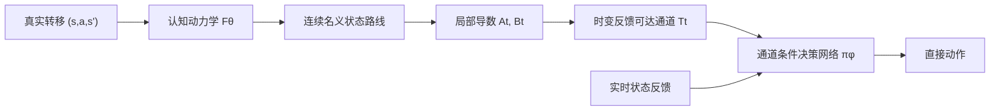

# CPBN：认知动力学到反馈可达通道

本分支是项目的精简研究主线。目标是：只在一种物理环境中预训练认知网络和决策网络；环境物理参数改变后，认知网络依靠真实状态转移持续学习，更新后的物理规律必须进入决策前向传播，从而带动策略快速恢复。

旧版分阶段实验保留在提交 `f458b37` 和分支 `feature/cognitive-embedded-decision` 中。当前主线位于 `feature/cognitive-pullback-bellman`。

## 研究约束

1. 认知网络只做状态转移预测，不产生动作；
2. 认知损失与决策损失分开，决策训练不能破坏认知参数；
3. 决策前向传播必须使用认知侧提供的动力学信息；
4. 决策网络直接输出动作，而不是在运行时对动作做迭代优化；
5. 源环境首先需要完成任务，之后再考察物理参数变化后的恢复速度。

## 已排除的路径：隐式 Bellman 动作层

最初的精简架构把价值函数通过动力学模型拉回动作空间：

\[
Q_{\theta,\phi}(s,a;g)
=r(s,a,F_\theta(s,a);g)
+\gamma V_\phi(F_\theta(s,a),g),
\qquad
a^*=\arg\max_a Q_{\theta,\phi}(s,a;g).
\]

Oracle 动力学实验中，动作求解器的 KKT 满足率和局部凹比例都是 100%，相对动作网格的 regret 约为 `-5.6e-8`，但任务成功率是 0/16。原因不是求解器不准确，而是一步 Bellman 目标没有传播“先摆动蓄能、再到达目标”的长时域可达性，最终收敛到低动作固定点。

因此当前不再继续调整隐式动作求解器。

## 当前主线：时变反馈可达通道

随后实验依次验证了粗状态路由、经验终点椭球和反馈通道。结果表明，认知网络向决策网络提供的数学对象非常关键：孤立终点或开环终点分布不能保证存在一个状态反馈策略将系统稳定送达。

当前算子链为：



在 Oracle 检查点中，先搜索一条连续 480 步状态路线，再从初始蓄能、高速运动和末端摆起三个阶段构造 24 步通道。局部动力学为

\[
\delta x_{t+1}\approx A_t\delta x_t+B_t\delta a_t,
\]

每个通道截面使用完整 `4×4` 精度矩阵描述角度—速度耦合关系：

\[
\mathcal T_t=
\{x:\delta x_t^\top P_t\delta x_t\le r_t\}.
\]

LQR 只用于证明通道具有反馈可执行性和生成构造样本；CEM 动作与 LQR 增益均不进入 Actor。决策网络只接收当前状态、白化通道误差、下一截面方向和相位，使用环境反馈通过 PPO 学习直接动作。

## 最新实验结果

正式配置为 150 轮训练、256 个并行环境、每条边 64 个独立测试扰动，随机种子为 0。最佳策略出现在第 50 轮。

| 指标 | 结果 |
|---|---:|
| 三条代表性通道完成率 | 100% / 98.44% / 100% |
| 总体完成率 | 99.48% |
| 全程通道保持率 | 98.96% |
| 随机常值动作完成率 | 16.67% |
| 打乱认知通道描述后的完成率 | 0% |
| 正确/错误描述的平均动作差 | 0.8257 |

预设条件为每条边完成率不低于 95%，当前检查点通过。打乱通道描述后完成率归零，说明策略强烈依赖认知侧提供的通道，而不是简单记住固定动作。

完整推导见 `docs/TIME_VARYING_TUBE_VALIDATION.md`，原始结果见 `results/time_varying_tube_validation_seed0.json`，实现位于 `cpbn/time_varying_tube.py` 和 `scripts/validate_start_route_tubes.py`。

## 当前边界与下一检查点

Oracle 检查点之后已经接入单一、未做物理语义分割的 ProtoKAN。它的局部动力学能够支撑反馈通道，但尚未完成整条路线的可靠规划，也没有进入参数变化后的在线恢复。


### 学得认知模型的最新定位结果

源环境单步训练得到切空间 RMSE `0.01269`、动作 Jacobian 平均余弦 `0.96587`，但 24 步最终 RMSE 为 `0.58256`；模型规划路线在模型内达到高度 `1.9995`，真实重放只有 `-0.8565`。多步预测和局部割线训练把 24 步最终 RMSE 降到 `0.26871`、真实局部通道总体完成率提高到 `63.02%`，但 480 步路线仍然失败。

定位实验固定一条真实连续路线，只让 ProtoKAN 提供局部动力学。此时三条通道在真实环境中的完成率为 `100% / 100% / 92.19%`，最低单边超过 90% 诊断门槛。这说明当前主要障碍是近似模型的超长开环规划误差，而不是 ProtoKAN 完全不能提供通道所需的局部物理信息。

完整记录见 `docs/LEARNED_COGNITIVE_TUBE_VALIDATION.md`。

### 源环境反馈走廊组合

把 24 步终点规划改为整条时间索引走廊后，冻结认知的完整任务最高高度为 `0.7631`，未成功；每执行 4 步就用真实转移更新 ProtoKAN 的条件在第 `469` 步成功，最高高度 `1.0415`。源参考路线本身在第 `474` 步成功，运行时只读取状态走廊，构造动作已丢弃。

在线认知把平均预测创新从 `0.00730` 降到 `0.00456`，并把平均局部规划终点距离从 `0.9593` 降到 `0.0963`。这首次在完整源任务上验证了“真实转移 → 认知更新 → 通道重建 → 决策变化”的闭环。完整记录见 `docs/FEEDBACK_CORRIDOR_SOURCE_VALIDATION.md`。

### 无动作教师的直接状态走廊 Actor

最新实验已经把隐藏的 CEM/LQR 控制器替换为 19,010 参数的 GRU Actor。Actor 只读取当前状态与未来 12 个状态走廊 token，没有状态到动作头的旁路，也没有接收 CEM 动作、LQR 增益或动作回归教师；它完全依靠真实环境奖励和 PPO 学习直接动作。

在 5 个独立测试种子、共 320 个扰动初态下，正确走廊的完整任务成功率为 `271/320 = 84.69%`，乱序走廊为 `2/320 = 0.63%`。这证明 Actor 确实利用了走廊中的长时域信息，而非绕过认知输入。但是源环境尚未达到可靠性门槛：第 14、16 个困难阶段的局部完成率只有 `25.00%` 和 `28.75%`。

当前定位是：接口方向成立，解码器仍不稳定。主要机制问题是走廊相位按时钟强制前进；Actor 落后时目标仍继续移动，缺少根据真实状态重新定位可达截面的反馈相位估计。针对困难相位的简单加权继续训练没有改善，并出现全路线遗忘。

完整推导、结构与结果见 `docs/DIRECT_CORRIDOR_ACTOR_VALIDATION.md`。

下一检查点是：

1. 用真实反馈估计或校正当前走廊相位，使偏离后的 Actor 能重新进入可达截面；
2. 在不遗忘已学阶段的条件下补强困难阶段，使源环境多种子成功率稳定通过门槛；
3. 再把在线 ProtoKAN 产生的动态走廊接入同一个 Actor，记录物理参数变化后的恢复曲线；
4. 消融固定相位、反馈相位、事件触发重规划和认知/决策分别更新；
5. 用探索数据或认证局部边替换当前源状态参考路线。

## 目录

```text
cpbn/
  acrobot.py                  # 可微环境与物理参数接口
  cognition.py                # 单体 ProtoKAN 状态转移认知模型
  bellman.py                  # 早期 Bellman 拉回基线
  reachability.py             # 粗状态路由基线
  reachability_funnel.py      # 开环终点椭球基线
  time_varying_tube.py        # 连续路线、局部线性化和反馈通道
  receding_tube.py            # 短时域局部规划与时变反馈
  feedback_corridor.py        # 时间索引状态走廊规划
  corridor_policy.py          # 必须读取状态走廊的直接 Actor/Critic
kanrf/                        # KAN / ProtoKAN 核心实现
scripts/
  validate_oracle_bellman.py
  validate_coarse_reachability.py
  validate_edge_funnels.py
  validate_start_route_tubes.py
  validate_learned_cognitive_tubes.py
  validate_learned_cognitive_tubes_v2.py
  diagnose_learned_route_vs_local_dynamics.py
  validate_receding_source_route.py
  validate_feedback_corridor_source.py
  validate_direct_corridor_actor.py
  refine_direct_corridor_actor.py
  evaluate_direct_corridor_actor_robust.py
docs/
  ARCHITECTURE.md
  COARSE_REACHABILITY_EXPERIMENT.md
  EDGE_FUNNEL_VALIDATION.md
  TIME_VARYING_TUBE_VALIDATION.md
  LEARNED_COGNITIVE_TUBE_VALIDATION.md
  FEEDBACK_CORRIDOR_SOURCE_VALIDATION.md
  DIRECT_CORRIDOR_ACTOR_VALIDATION.md
results/
  oracle_implicit_bellman_seed0.json
  time_varying_tube_validation_seed0.json
  learned_cognitive_tube_validation_seed0.json
  learned_cognitive_tube_multistep_seed0.json
  learned_route_vs_local_dynamics_seed0.json
  receding_source_route_seed0.json
  feedback_corridor_source_seed0.json
  direct_corridor_actor_seed0.json
  direct_corridor_actor_strong_seed0.json
  direct_corridor_actor_refined_seed0.json
  direct_corridor_actor_robust_seed0.json
tests/
```

## 环境与运行

本机所有 Python 命令必须使用 `dl_env`：

```powershell
C:\Users\32510\miniconda3\envs\dl_env\python.exe -m scripts.validate_start_route_tubes `
  --iterations 150 --num-envs 256 --rollout-horizon 96 `
  --json-out results\time_varying_tube_validation_seed0.json
```

快速语法验证：

```powershell
C:\Users\32510\miniconda3\envs\dl_env\python.exe -m compileall -q cpbn kanrf scripts tests
```

当前分支是理论与最小实现检查点，不宣称已经得到可投稿的最终算法。
