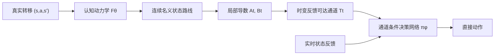

# CPBN：认知动力学到反馈可达通道

本分支是项目的精简研究主线。目标是：只在一种物理环境中预训练认知网络和决策网络；环境物理参数改变后，认知网络依靠真实状态转移持续学习，更新后的物理规律必须进入决策前向传播，从而带动策略快速恢复。

旧版分阶段实验保留在提交 `f458b37` 和分支 `feature/cognitive-embedded-decision` 中。当前主线位于 `feature/cognitive-pullback-bellman`。

## 研究约束

1. 认知网络只做状态转移预测，不产生动作；
2. 认知损失与决策损失分开，决策训练不能破坏认知参数；
3. 决策前向传播必须使用认知侧提供的动力学信息；
4. 决策网络直接输出动作，而不是在运行时对动作做迭代优化；
5. 源环境首先需要完成任务，之后再考察物理参数变化后的恢复速度。

## 已排除的路径：隐式 Bellman 动作层

最初的精简架构把价值函数通过动力学模型拉回动作空间：

\[
Q_{\theta,\phi}(s,a;g)
=r(s,a,F_\theta(s,a);g)
+\gamma V_\phi(F_\theta(s,a),g),
\qquad
a^*=\arg\max_a Q_{\theta,\phi}(s,a;g).
\]

Oracle 动力学实验中，动作求解器的 KKT 满足率和局部凹比例都是 100%，相对动作网格的 regret 约为 `-5.6e-8`，但任务成功率是 0/16。原因不是求解器不准确，而是一步 Bellman 目标没有传播“先摆动蓄能、再到达目标”的长时域可达性，最终收敛到低动作固定点。

因此当前不再继续调整隐式动作求解器。

## 当前主线：时变反馈可达通道

随后实验依次验证了粗状态路由、经验终点椭球和反馈通道。结果表明，认知网络向决策网络提供的数学对象非常关键：孤立终点或开环终点分布不能保证存在一个状态反馈策略将系统稳定送达。

当前算子链为：



在 Oracle 检查点中，先搜索一条连续 480 步状态路线，再从初始蓄能、高速运动和末端摆起三个阶段构造 24 步通道。局部动力学为

\[
\delta x_{t+1}\approx A_t\delta x_t+B_t\delta a_t,
\]

每个通道截面使用完整 `4×4` 精度矩阵描述角度—速度耦合关系：

\[
\mathcal T_t=
\{x:\delta x_t^\top P_t\delta x_t\le r_t\}.
\]

LQR 只用于证明通道具有反馈可执行性和生成构造样本；CEM 动作与 LQR 增益均不进入 Actor。决策网络只接收当前状态、白化通道误差、下一截面方向和相位，使用环境反馈通过 PPO 学习直接动作。

## 最新实验结果

正式配置为 150 轮训练、256 个并行环境、每条边 64 个独立测试扰动，随机种子为 0。最佳策略出现在第 50 轮。

| 指标 | 结果 |
|---|---:|
| 三条代表性通道完成率 | 100% / 98.44% / 100% |
| 总体完成率 | 99.48% |
| 全程通道保持率 | 98.96% |
| 随机常值动作完成率 | 16.67% |
| 打乱认知通道描述后的完成率 | 0% |
| 正确/错误描述的平均动作差 | 0.8257 |

预设条件为每条边完成率不低于 95%，当前检查点通过。打乱通道描述后完成率归零，说明策略强烈依赖认知侧提供的通道，而不是简单记住固定动作。

完整推导见 `docs/TIME_VARYING_TUBE_VALIDATION.md`，原始结果见 `results/time_varying_tube_validation_seed0.json`，实现位于 `cpbn/time_varying_tube.py` 和 `scripts/validate_start_route_tubes.py`。

## 当前边界与下一检查点

这还不是最终泛化结果：动力学目前仍是 Oracle，只验证了源环境中的三个独立片段和一个训练种子；尚未完成整条路线的串联，也没有验证参数变化后的在线恢复。

下一检查点是：

1. 用单一源环境的转移数据预训练 ProtoKAN 认知动力学；
2. 在目标物理参数下根据真实转移持续更新 ProtoKAN；
3. 由更新后的认知模型重估通道，并在模型失配超阈值时重新规划；
4. 保持决策网络结构不变，记录成功率随在线 episode 的恢复曲线；
5. 对比不更新认知、只更新认知、认知与决策共同更新三种条件。

## 目录

```text
cpbn/
  acrobot.py                  # 可微环境与物理参数接口
  bellman.py                  # 早期 Bellman 拉回基线
  reachability.py             # 粗状态路由基线
  reachability_funnel.py      # 开环终点椭球基线
  time_varying_tube.py        # 连续路线、局部线性化和反馈通道
kanrf/                        # KAN / ProtoKAN 核心实现
scripts/
  validate_oracle_bellman.py
  validate_coarse_reachability.py
  validate_edge_funnels.py
  validate_start_route_tubes.py
docs/
  ARCHITECTURE.md
  COARSE_REACHABILITY_EXPERIMENT.md
  EDGE_FUNNEL_VALIDATION.md
  TIME_VARYING_TUBE_VALIDATION.md
results/
  oracle_implicit_bellman_seed0.json
  time_varying_tube_validation_seed0.json
tests/
```

## 环境与运行

本机所有 Python 命令必须使用 `dl_env`：

```powershell
C:\Users\32510\miniconda3\envs\dl_env\python.exe -m scripts.validate_start_route_tubes `
  --iterations 150 --num-envs 256 --rollout-horizon 96 `
  --json-out results\time_varying_tube_validation_seed0.json
```

快速语法验证：

```powershell
C:\Users\32510\miniconda3\envs\dl_env\python.exe -m compileall -q cpbn kanrf scripts tests
```

当前分支是理论与最小实现检查点，不宣称已经得到可投稿的最终算法。
