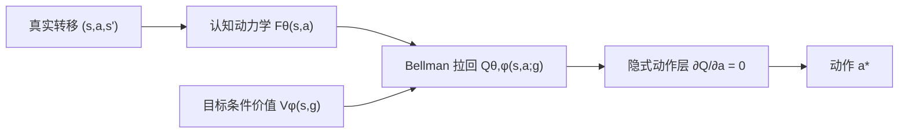

# CPBN：认知拉回 Bellman 网络

本分支是项目的精简研究主线。目标仍然是：只在一种物理环境中预训练认知网络和决策网络；环境物理参数改变后，认知网络依靠真实转移持续学习，更新后的物理规律必须进入决策前向传播，从而带动策略快速恢复。

旧版数百个分阶段实验已经从本分支移除，但完整保留在提交 `f458b37` 和分支 `feature/cognitive-embedded-decision` 中。

## 核心结构



认知网络只做预测：

\[
\theta \leftarrow \arg\min_\theta
\mathbb E\|F_\theta(s_t,a_t)-s_{t+1}\|^2.
\]

决策侧不复制认知参数，也不使用稀疏探针。它把价值函数通过完整动力学算子拉回动作空间：

\[
Q_{\theta,\phi}(s,a;g)
=r(s,a,F_\theta(s,a);g)
+\gamma V_\phi(F_\theta(s,a),g),
\qquad
a^*=\operatorname*{argmax}_{a\in[-1,1]}Q_{\theta,\phi}(s,a;g).
\]

当前一维动作通过求解 `∂Q/∂a = 0` 得到，没有独立 Actor 参数。因此动作的前向计算必然经过认知动力学；在线更新 `θ` 会直接改变动作方程。

认知损失和决策损失仍然严格分开：更新认知网络时只使用转移预测损失；更新决策价值时冻结认知参数。

## 当前验证结论

当前保留的 Stage78 检查点先用真实动力学替代 ProtoKAN，只验证“价值网络 + 隐式动作层”本身。正式结果位于 `results/oracle_implicit_bellman_seed0.json`。

| 指标 | 结果 |
|---|---:|
| 源环境成功率 | 0/16 |
| 平均最高末端高度 | -1.9566 |
| 隐式解 KKT 满足率 | 100% |
| 局部凹比例 | 100% |
| 相对 129 点网格的平均 regret | 约 `-5.6e-8` |
| 可训练 Actor 参数 | 0 |

这组结果把问题定位得很清楚：动作求解器准确地求出了当前 Bellman 目标的最优动作，但当前价值学习没有传播“先摆动积累能量、再到达目标”的长时域可达性。求解器优化得很准，优化的目标却是错的。

冷启动时 `V≈0`，一步目标几乎只看到微弱的高度变化和 `-0.005a²` 动作惩罚，于是 `a≈0` 成为自洽解。仅在全状态均匀样本上重复一步拟合价值，不能自动打破这个低动作固定点。

因此，下一研究问题不是继续调隐式求解器，而是构造一个能从成功边界向初始状态传播可达性的决策算子，同时保持：

1. 认知网络仍只由预测损失训练；
2. 决策前向传播必须使用完整认知算子；
3. 认知更新后，不依赖重新训练大型 Actor 就能改变决策；
4. 源环境首先能稳定完成 Acrobot，再讨论参数变化后的恢复曲线。

## 精简后的目录

```text
cpbn/
  acrobot.py       # 可微环境、任务目标和 Oracle 认知接口
  bellman.py       # Bellman 拉回与无 Actor 的隐式动作层
  networks.py      # 目标条件价值网络
kanrf/             # KAN / ProtoKAN 核心实现
scripts/
  validate_oracle_bellman.py
tests/
docs/
  ARCHITECTURE.md  # 数学结构、训练隔离和当前失败推导
results/
  oracle_implicit_bellman_seed0.json
```

## 环境与运行

本机所有 Python 命令都必须使用 `dl_env`：

```powershell
C:\Users\32510\miniconda3\envs\dl_env\python.exe -m scripts.validate_oracle_bellman `
  --json-out results\oracle_implicit_bellman_seed0.json
```

快速语法与最小行为验证：

```powershell
C:\Users\32510\miniconda3\envs\dl_env\python.exe -m compileall -q cpbn kanrf scripts tests
```

本分支当前是理论和最小实现检查点，不宣称已经得到可投稿的最终算法。
